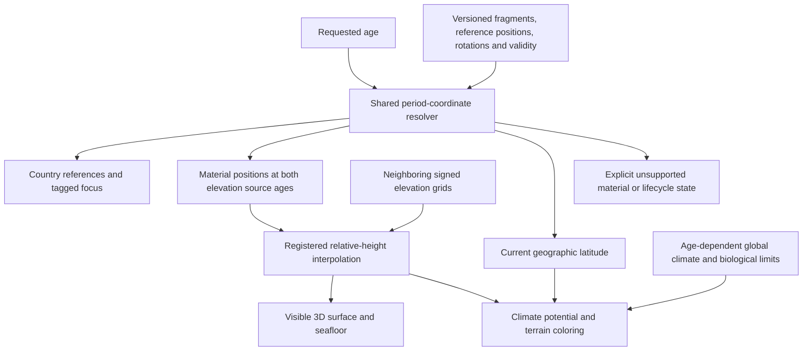

# Palaeomap accuracy and a compact reconstruction pipeline

EarthHistory can improve substantially by preserving more of its existing elevation source, adding published plate-boundary geometry, and making the compatibility between sources an explicit data contract. The baseline palaeomaps already derived from Scotese and Wright's numeric PALEOMAP elevation models. Their sparse appearance was partly a preparation choice: the original application selected 18 ages and sampled them at 2° spacing. A change of provider alone would leave that loss of information unresolved.

The recommended approach is incremental. First expose the complete native PALEOMAP time series and preserve camera zoom while following a location. Next increase source-controlled spatial detail under measured memory limits. Develop a versioned GPlates plate model as the tectonic foundation, with its own reconstructed continents and boundaries, and combine other geography only after a documented coordinate conversion. The longer-term unified surface should distinguish published elevation, categorical environmental constraints, physical model output and procedural visual detail.

This report separates acquired source material, behavior implemented in the application, and proposed scientific integration. Downloaded data is not automatically a validated runtime layer. The [runtime audit](palaeomap-runtime-audit.md), [plate foundation study](palaeomap-plate-foundation.md), [geography and relief study](palaeomap-geography-relief.md), and [North Sea study](palaeomap-north-sea.md) provide the detailed evidence and inventories behind these recommendations.

## Implemented first phases

The working tree now serves all **109 native v2 ages**, every 5 Ma from 0 to 540 Ma, and preserves the source's **1° sampling** instead of reducing it to 2°. Each static elevation file contains a validated 16-byte header and 360 × 181 signed 16-bit metre samples (130,336 bytes total). Preparation validates both actual source grid layouts and records the 50 ages requiring a −89° row closure at the south pole. The known modern duplicate-meridian correction remains narrowly scoped. This retains four times as many control samples at most locations; it does not claim four times the scientific accuracy.

The source selector is separate from narrative chapters. Elevation, country-reference and tracking loaders each retain at most three age entries and abort evicted requests. A location followed through time retains the camera radius, including disappearance and later reacquisition. New explicit location selection and reset retain their existing zoom behavior.

Natural terrain materials now use source elevation gradients for rock exposure and roughness, with gradual temperature/elevation/aridity color transitions where no compatible climate experiment is loaded. Signed bathymetry remains numeric relief. Authored tectonic story strokes no longer emboss arbitrary ridges, mountain bands or trenches into the PALEOMAP surface; geological reference linework is optional. The separate Cao view described below adds source-positioned boundary relief with explicit synthesis status. Country-reference rendering uses thin, subdued, terrain-lit ribbons. Their drape intersects the published terrain triangles and scales subdivision error with display exaggeration; short unsupported fragments are suppressed without connecting across gaps. Guide labels are now subdued curved patches sharing globe lighting and depth, so they read as surface print rather than floating billboards; latitude lines and true-pole targets remain distinct reference graphics.

An independent coordinate-by-coordinate comparison verified all 7,102,440 generated elevation values against the pinned source CSVs after the disclosed adapters, together with every binary header and exact length. The binary elevation stack totals 14,206,624 bytes. The first completed production build with these controls measured approximately **42.23 MiB**, below the existing 50 MiB artifact ceiling. Analytical source and cache sizes are not browser heap measurements. Measured production controls at modern Earth and 95 Ma retained 16.7–16.8 ms candidate frame p95; finer historical sampling/material generation added about 43 ms at the historical control. Navigation-to-ready remained approximately 628–764 ms, preserving an existing readiness miss. These measurements did not establish a browser-heap or GPU-memory ceiling. Final validation and measured rendering results are recorded in the [runtime audit](palaeomap-runtime-audit.md) and [performance evidence](palaeomap-render-validation.json).

The first implementation checkpoint completed 128 unit/data tests and successful coverage of all 20 browser cases; the browser suite required one targeted rerun after updating an assertion for the intentional seafloor-label change. Source assets, artifact size and cache checks passed. These results precede the continuous-coordinate work below and are not its final acceptance result.

The newer 113-age relief release, climate experiment ingestion and restored North Sea constraints remain later scientific phases. Their acquired inputs, uncertainties and concrete acceptance checks are documented below; they are not represented as completed runtime integrations.

## Continuous-coordinate implementation status

The shared period-coordinate implementation names the model, version, reference frame, anchor plate, axes and age. Material coordinates use a valid reference age and a reconstruction circuit; they do not assume that ancient ocean crust survives to the present. Countries and tagged locations use that same contract. Poles and latitude guides stay in the geographic frame, and environmental potential uses latitude after reconstruction.

For PALEOMAP, the renderer now inverse-reconstructs each displayed mesh sample to the two source ages before interpolating elevation. Exact source ages recover native source heights. Geographic raster blending is not used as a substitute for material correspondence. Unsupported correspondence remains explicit. Atomic, bounded tile updates let the requested age advance without allocating a new global surface for every slider event. Fine visual texture affects shading rather than changing source elevation at native knots. The predecessor satellite-style material pass added albedo, bump and roughness variation, more oblique illumination and a thin subdued atmospheric limb. A subsequent review found that a stable random seed did not keep endpoint-generated texture attached to moving material; the frequency follow-up now addresses that coordinate discontinuity as well as excessive fine-scale variation. These are procedural appearance cues, not photographic observations or additional source resolution. Close views still expose coarse palaeoterrain controls, especially in the optional Cao conversion. Visual and performance acceptance remain separate from source-coordinate correctness.

The corrected deterministic checkpoint passed 173 tests in 30 files and verified 339 scientific assets. Repeated production probes recorded 16.7–16.8 ms steady frame p95 and a largest measured temporal work chunk of 11.4 ms. These are intermediate PALEOMAP results; subsequent Cao integration requires another complete gate and production comparison. The [continuous validation record](palaeomap-continuous-validation.json) preserves the rejected measurements, restored mutations, build hashes and corrected results.

Cao 2024 v2.4 has separate static continental fragments and evolving ocean topologies. A continental conversion through those persistent fragments preserves supported round trips to numerical precision, but the corrected 2° global probe recovered only 88.47%, 81.17% and 81.17% of sampled stable continental interiors at 100, 250 and 400 Ma. It therefore failed the predeclared 90% threshold for replacing the complete default globe. PALEOMAP remains the default; the Cao integration identifies unsupported converted terrain instead of filling it with incompatible source pixels. Numerical round-trip precision is not geological accuracy. The [crosswalk validation](palaeomap-static-crosswalk-validation.json) separates the rejected topology-identity method from the corrected fragment method and its remaining source-coverage gaps.

The optional Cao ocean integration now uses Cao-native topologies, typed spreading/subduction boundaries and separately attributed formation/loss intervals. A topological point becoming inactive is not by itself evidence of ridge formation or subduction: source gaps and topology corrections remain unattributed. Ocean depth inferred from thermal subsidence and boundary profiles is a stated model, distinct from published PALEOMAP elevations. Production browser checks verify that seafloor geometry, boundary relief, country references and points of interest publish at a common displayed age during continuous input, including jumps across native source knots. The preceding complete terrain stays visible while its replacement is prepared; tagged focus follows the displayed age and preserves zoom. The final bounded Cao renderer uses 18 projected L0/L1 tiles while settled, with 6 coarse live tiles during input. Repeated complete preparation/publication costs were 454.8–474.6 ms across fixed-age and sustained-input probes; frame p95 was 16.7–16.8 ms on the measured Apple M4/Chrome configuration. In-page timers requested at 16 ms actually arrived at median 30.5–35.1 ms intervals, so these measurements do not establish 60 Hz input processing. Full detail settled 1.25–1.32 seconds after the last input, and initial readiness took 1.77–1.91 seconds. These readiness misses and the partial Cao close-view quality remain explicit. The pre-frequency-refinement build (`605392…`) completed `make gate-full` successfully: 204 unit/data tests in 34 files, all 24 browser tests, and 343 verified scientific assets. The tested production distribution is 49,097,762 bytes (46.82 MiB). Its exact build hash, restored failure controls and earlier rejected results remain in the continuous validation record.

## Structured material refinement and geological test

The subsequent frequency refinement separates broad color variation from subdued, source-conditioned lighting detail. It removes unresolved fine bands and reduces excessive coordinate warp. A stable seed alone was insufficient: endpoint-generated texture could change as a moving material changed source maps. The corrected PALEOMAP path samples visual detail in reference-material coordinates at both exact and intermediate ages. A temporary shading-position buffer derives lighting normals; the published physical geometry and overlay height sampler remain based on source elevation. Mixed-resolution edge normals are reconciled before publication. Scalar surface/seafloor roughness is a rendering convention rather than a measured palaeosurface property.

The extra shading buffer is 13,068 bytes for one 32×32 tile update and is released after normal calculation. It adds no second terrain draw or detail texture. A two-entry source-ruggedness cache is bounded to 130,320 bytes for the native 1° controls. Settled work waits for tile refinement, eliminating repeated calculation of superseded tiles. Live previews retain six coarse tiles, while settled high-quality PALEOMAP views preserve projected refinement up to L4 and 96 tiles. A renderer checkpoint at 100 Ma retained the same 96-tile distribution as its control. Repeated material publication was about 300–304 ms and steady frame p95 was 16.7 ms. Its approximately 1.08–1.11 second preparation result precedes the final overlay synchronization fix and does not establish fully synchronized readiness. These scene-specific measurements do not establish unrestricted performance or a total GPU-memory ceiling; the validation ledger identifies the measured artifact separately from the final build. Country ribbons received a modest contrast/opacity increase at unchanged width. The continuous validation ledger preserves the rejected coarse-LOD comparison and records final full-gate acceptance separately.

The regional material profile is latched with each temporal update, so exact and interpolated terrain use the same zoom-appropriate shading treatment. Installing a new terrain sampler now schedules overlay replacement and marks it as updating; the preceding visible overlay remains until the matching replacement is ready. The focused browser case verifies actual applied sampler identity through fractional and exact ages, relief changes and regional zoom. A separate endpoint audit caught loss of existing modern refinements. Exact 0 Ma now retains registered ETOPO/EMODnet physical patch heights and native climate-based albedo. Those modern inputs remain valid only at 0 Ma: the open 0–5 Ma interval uses the canonical PALEOMAP controls, so a local detail/color boundary can remain at the transition. This is an explicit data-validity limitation, not a claim that modern observations reconstruct the intervening history.

The requested [Caledonian test](palaeomap-caledonian-test.md) follows reconstructed material across all 109 source ages. It finds a broad high belt by 420 Ma across western Norway, northwest Scotland and East Greenland. Neither the elevation series nor equal-view production captures independently resolves the subsequent extensional-collapse process. Persistently high relief is not itself inconsistent with extension and exhumation; there is no quantitative palaeoelevation history or event-specific structural control in these inputs that could establish that claim. Present high terrain also includes later geological effects and cannot be attributed directly to retained Caledonian elevation. This is an explicit partial geological result, not a complete collapse/remnant validation. The regional app view still reads as broad uplift rather than a strongly dissected mountain chain. The separately generated mountain illustration is a visual target, not an app capture or a quantitative reconstruction.

## Reference-driven terrain appearance

The user supplied visual references for the Alps, Andes, Mid-Atlantic Ridge, Japan and Ethiopian Rift. The current appearance pass uses physical reconstructed elevation and local relief to control exposed-rock color and the strength of a connected ridge/valley shading hierarchy. Lower ranges retain softer vegetated material; higher ranges gain stronger rock exposure and internal relief contrast. Snow remains climate-qualified. Display exaggeration is separate from the physical-height style input. Procedural detail follows reference material coordinates, so the pattern stays attached while source-interpolated height changes its expression. These are synthesized appearance cues, not recovered observations of ancient valleys.

The regional profile includes a bounded additional frequency band within the mountain mask. It retains coarse detail at wider views, source heights in the visible geometry, and shared-edge normal handling. The modern native albedo already contains this treatment and is applied once. Independent consumer checks prove that changing physical source height changes the baked material without changing source heights; disabling height dependence fails the check.

Actual image review exposed additional information loss in the renderer. Modern source gradients were being reduced to coarse global shading inputs, and post-budget tile balancing could discard all fine terrain near the inspected location. The corrected cube path uses local ETOPO gradients and a feathered source-height residual for shading, increases only intersecting regional tile textures from 64 to 128 density, and preserves the source physical surface. Outside the patch, bump perturbation becomes neutral; roughness remains scalar to avoid tile-wide material seams. The old independent regional overlay is not drawn over the authoritative cube mesh.

Tile selection reserves the neighbor refinement required by its 2:1 edge rule before accepting a split. It tries another useful candidate when the first cannot fit; the existing 96-leaf limit is unchanged. Seven modern camera probes reach the finest permitted level at the inspected center, with measured selector medians 2.9–4.7 ms on the tested Apple M4. This is selector CPU evidence, not complete renderer performance. Closer aerial zoom is permitted to radius 1.15, while country widths and point-of-interest sprites become smaller in world units as the camera approaches so their screen appearance stays restrained. Physical-height styling remains separate from display exaggeration; the regional synthesis profile currently caps its spatial input frequency at 144 and the coarse profile at 18.5.

The finer selection also exposed a fractional-age cache deadlock. Old visible or staged meshes already owned their field arrays, but repeatedly reinserting those arrays could evict the next view before its atomic publication. The desired tree needs 126 cache entries in the reproduced case; the previous and next trees together need 206, exceeding the existing 160-entry limit. Render planning now recognizes mesh-owned fields directly, excludes obsolete cache touches and disposes hidden superseded staging. The same 102.5 Ma close view completes in 3.08 seconds with 96 visible tiles and two evictions; before the fix it still had no current visible tiles after 60 seconds and hundreds of thousands of evictions. The 48 MiB cache byte limit and 160-entry limit remain unchanged.

Modern regional controls now include two additional 256 × 256 ETOPO 2022 v1 crops for the Alps and Japan, totaling 350,529 application bytes. Both retain the source's EPSG:4326 coordinates and EGM2008 metre elevations and are valid only at 0 Ma. They extend the existing modern reference regions; they are not substituted for ancient terrain. Explicit mode metadata permits the same decoded Andes, East African Rift, Mid-Atlantic and Japan controls to supply both surface-water appearance and exposed-seafloor relief without a duplicate asset or cache entry. Greenland remains surface-only; EMODnet LAT North Sea controls remain seafloor-only.

In surface-water mode, signed depth controls restrained blue bathymetric color and apparent shading normals while the physical water shell remains at sea level. Exposed-seafloor mode retains signed physical depth. The current production captures verify active source patches, signed source depth, a sea-level water shell, and matching terrain/overlay sampler identities. They show improved regional relief but still have generalized background color, coarse shorelines and less valley detail than the supplied satellite-map references. The final native publication path restores positions, stitched normals and texture coordinates from immutable source fields at the current display exaggeration; it avoids recomputing temporal colors that were subsequently discarded. Automatic camera focus also waits until its destination to request camera-dependent refinement, and manual input cancels that animation. Paired production Alps transitions sum to 347 and 392 ms of tile generation and publication, with complete readiness at 1.37–1.41 seconds. Historical material preparation remains within its original 500 ms component bound, but a newly expanded sum including source roots and refinement is 513–529 ms and remains above 500 ms. These are separate accounting scopes, not evidence that every preparation or latency target passes. Steady frames remain approximately 16.7–16.8 ms on the tested machine. The final full gate completed on this same renderer: 224 unit/data tests, 345 scientific assets and all 24 browser cases passed. The preceding run’s obsolete guide-source test requirement was corrected without changing the production artifact.

### Final measured rendering checkpoint

The final renderer artifact is `4b9554a7b985fa45452b7bfaa4726db2a2ad96127f8cfc27b8ac071e6d692737` (49,483,584 bytes). The following paired measurements use production Chrome on the recorded Apple M4 machine and require matching displayed terrain and overlay identities. They describe steady rendering and scene preparation separately.

| Scene | Steady frame p95 | Material/publication component | Sum including roots and refinement | Fully ready |
| --- | --- | --- | --- | --- |
| Modern Alps, close aerial | 16.7 ms | Native publication 6.0–6.7 ms | 346.8–391.8 ms | 1.37–1.41 s |
| PALEOMAP at 100 Ma | 16.8 ms | 300.3–305.1 ms | 512.7–524.9 ms | 1.19–1.21 s |
| Cao view at 100 Ma | 16.7–16.8 ms | 445.6–451.4 ms including Cao preparation | 517.2–528.7 ms | 1.57–1.61 s |

The earlier 500 ms material/preparation component threshold passes. The expanded all-stage comparison remains above 500 ms for historical views, and readiness remains above earlier camera/regional latency goals. Neither steady frame rate nor the 48 MiB terrain-cache cap establishes a portable whole-browser memory or interaction-latency guarantee. Exact logs, controls, machine metadata and excluded probes are in the [validation ledger](palaeomap-continuous-validation.json).

## Source assessment

| Source family | What it can supply | What it does not establish | Recommended role |
| --- | --- | --- | --- |
| GPlates model catalog / Cao 2024 / Müller and Merdith models | Rotations, reconstructable continental geometry, evolving plate topologies, spreading ridges, transforms and subduction with polarity | Ancient shoreline, elevation, water depth or climate simply from a plate polygon | Versioned tectonic foundation and explicit alternative reconstructions |
| Scotese–Wright PALEOMAP numeric paleoDEMs | Interpreted elevation/depth: v2 has 109 native ages to 540 Ma; v24221 has 113 to 750 Ma | Measured regional accuracy, continuous temporal observations, or compatibility with any other plate model | Improve current family first; validate newer v24221 as a material source update |
| Cao et al. 2017 | Reconstructed landmass, shallow-marine, mountain and ice categories with matching reconstruction inputs | Numeric mountain height, quantitative bathymetry, or a continuous climate history | Categorical constraints and comparison in its own model family |
| NOAA Science On a Sphere PALEOMAP atlas | Educational global map imagery and narrative coverage extending to 750 Ma | A numeric elevation dataset or an automatic grant of rights to Scotese's imagery | Visual/scientific comparison and a route to the original creator's sources |
| NSTA regional geological maps | North Sea depositional facies, structural interpretations, explanatory maps and stratigraphic context | Time-restored terrain or palaeowater depth from buried horizons | Bounded aerial regional evidence layers |
| Pohl et al. Phanerozoic climate experiments | Model-derived monthly climate fields and supplied topography/classification at 28 native ages | Direct observations at every location or climate for every 5 Ma surface | Climate controls in compatible geography, with interpolation disclosed |

The relevant official starting points are [GPlates' model catalog](https://gwsdoc.gplates.org/models), [Cao et al. 2017](https://doi.org/10.5194/bg-14-5425-2017), [Scotese–Wright paleoDEMs](https://doi.org/10.5281/zenodo.5460860), [NOAA's PALEOMAP atlas](https://sos.noaa.gov/catalog/datasets/paleomap-paleoatlas-0-750-million-years-ago/), and [Pohl's climate dataset](https://zenodo.org/records/6620748). Exact archive inspections, versions and source-specific restrictions are recorded in the companion studies.

### Licenses belong to individual inputs

GPlates software licensing and the rights to a particular reconstruction dataset are separate. The selected pinned Zenodo plate-model records carry CC BY 4.0, while GPlates-related software has GPL licensing. Using published coordinates as offline inputs does not justify assigning either license to every file linked from the catalog. The same distinction applies to code, paper figures, supplemental data and processed assets.

Cao's paper has a publication license, but the linked GitHub repository lacks a repository-wide license declaration. The official data package and any paper supplement must be evaluated on their own terms before derived content enters a build. NOAA attribution to Scotese is not a declaration that his images are US-government public-domain works. For numeric relief, the explicit CC BY 4.0 Zenodo deposit is the clearer source. Both NSTA archives explicitly name the Open Government Licence in their enclosed documentation and publisher records, resolving the blank license field in CKAN. The acquisition ledger preserves these distinctions instead of treating successful download as redistribution permission.

## Why present maps lose detail

The baseline preparation code chose a small subset of source ages and sampled elevation at every second degree. In latitude, 2° is approximately 222 km; that spacing cannot retain many shelves, narrow seas, mountain belts or regional coastlines. The renderer can add smoothness and surface texture, but interpolation and noise cannot recover a land–sea boundary that the preparation stage discarded.

There are also independent scientific simplifications. Current tectonic features are authored illustrative strokes rather than a complete reconstruction of plate boundaries. Historical environmental controls use procedural potential based on latitude, elevation and broad biological/era state. Contemporary climate classifications are only used at the modern age. Increasing the number of elevation slices improves temporal fidelity, but it does not replace those tectonic or climate methods.

The baseline application already had displaced terrain, a seafloor view, cube-sphere refinement and worker-based generation. The relief work should build on those mechanisms rather than replace the graphics stack. The next quality improvement must be measured against its source sample: a more detailed image is not necessarily a more accurate geological reconstruction.

## Time is a set of evidence coordinates

The actual PALEOMAP CSV archive contains 109 grids at 0, 5, 10, …, 540 Ma. The 0.1° NetCDF archive represents the same age series. Two filenames in the 1° NetCDF collection use 385.2 and 390.5, but the accompanying model-time mapping associates them with 385 and 390 Ma. These must not become extra independent evidence slices merely because their filenames differ.

The newer licensed PALEOMAP v24221 archive has 113 numeric grids: those same 109 nominal ages plus 600, 630, 690 and 750 Ma. All 109 shared grids differ from v2, and some variable names and attributes also changed. It is the recommended newer relief candidate after explicit schema, coastal and visual validation, not a silent addition of four files to the existing family. Its full age inventory and measured differences are in the [geography study](palaeomap-geography-relief.md), with the [exact dataset record](https://zenodo.org/records/10659112).

Cao 2017 instead has 24 reconstructions at 6, 14, 22, 33, 45, 53, 76, 90, 105, 126, 140, 152, 169, 195, 218, 232, 255, 277, 287, 302, 328, 348, 368 and 396 Ma, with irregular geological validity intervals. The climate experiments provide 28 ages every 20 Ma from 0 through 540. Plate rotations may be evaluable at intermediate times, but that does not create an independently reconstructed DEM or climate experiment at each intermediate time.

Keep authored chapters separate from source timesteps. Chapters explain events; source steps navigate available data. At an arbitrary requested age, display the selected geography age and each auxiliary layer's actual age or interval. If climate is interpolated, identify its two source experiments and method. Do not describe a 5 Ma elevation grid carrying interpolated climate as a complete 5 Ma climate reconstruction.

Temporal transitions must preserve plate and terrain identity. A straight blend between unrelated rasters can create transient islands, bridge oceans, or erase a mountain belt while a plate moves. Smooth movement is restricted to validated common material coordinates; source ages remain separately navigable evidence slices. Crossfades can communicate a transition visually but do not establish continuity of evidence.

A tagged location is likewise an identity, not a fixed screen coordinate. Advance its plate/fragment reconstruction when supported, retain its descriptor while temporarily unavailable, and reacquire it when evidence returns. These operations change camera direction while preserving the current radius. A new user-requested focus or reset can choose a new zoom explicitly.

## Architecture for continuous geological time

The user has explicitly selected smooth movement and relief evolution between native reconstruction ages and authorized implementation. Period coordinates are the shared foundation for terrain, modern-country references, tagged areas and points, tectonic features and climate sampling. These consumers must use one versioned resolver rather than independent position interpolation. This makes persistent material identity a prerequisite for the new source pipeline. Keep one named global model/reference frame, stable material or fragment IDs, reference-age coordinates attached to that material, and time-dependent plate membership/rotation or deformation. Latitude and longitude at a particular age are derived positions; they are not the persistent identity of a terrain sample. Geographic graticules and the poles intentionally remain in the globe's geographic frame; climate latitude is evaluated in that frame after material reconstruction.

For a persistent sample `i`, the rigid case is `position(i,t) = relativeRotation(lineage(i), referenceAge → t) × referencePosition(i)`. Evaluate rotations through the model's hierarchy and intermediate rotation knots, using its reconstruction semantics; do not independently linearly blend longitude/latitude or arbitrary total quaternions across hierarchy changes. GPlates provides finite-rotation spherical interpolation, while reconstruct-by-topologies supports deformation and point lifetimes. [FiniteRotation documentation](https://www.gplates.org/docs/pygplates/generated/pygplates.FiniteRotation.html), [crustal deformation documentation](https://www.gplates.org/docs/user-manual/crustaldeformation/).

After neighboring elevation sources are registered to the same material samples, an initial height model can use `h(t) = (1 − u)h0 + u h1`, where `u = (t − t0)/(t1 − t0)` uses actual age in millions of years, not chapter order or slider-step index. A sample changing from −2,000 m to 0 m has −1,000 m relative height halfway through that interval. This is an interpolation assumption, not evidence that uplift was uniform. Where only elevation relative to each age's interpreted sea level is supplied, interpolating those values cannot separate uplift, subsidence and sea-level change. Store physical bed height and sea level separately when their common-datum values are supported; otherwise label the result relative-elevation interpolation.

A mountain must move with its material coordinates while its height changes. Blending fixed geographic raster pixels can instead make a moving mountain disappear in one place and appear in another, and can create false land bridges or islands. Offline conversion should therefore export correspondence IDs or a validated deformation mapping between adjacent reconstruction knots. A triangle or tile pair must declare whether its material correspondence and topology are stable throughout the interval.

The display mesh itself may remain fixed in geographic space if its samples use the same material resolver: resolve ownership at the requested age, transform that material to each neighboring source age, sample the two elevations at those respective positions, then interpolate relative height. This inverse-sampling approach can retain the existing cube-sphere tessellation without treating fixed geographic pixels as matching material. Coverage and lifecycle masks are still required; a display mesh cannot supply geological ancestry missing from the source.

Ocean crust birth at a spreading ridge, loss at subduction, plate splits and deforming margins require explicit interval events. Unsupported samples do not acquire a fictitious ancestor or descendant. Persistent ridge, margin and orogen feature IDs also need lifecycle/semantic rules: a plate-boundary line is not a material terrain parcel, and a mountain belt may survive an inactive margin. The acquired global rasters do not themselves supply these correspondences. The implemented Cao preprocessing therefore traces model-native points and attributes terminal events to nearby typed boundaries, retaining unknown and censored states. Its coarse lifecycle estimates are model-derived constraints, not measured seafloor ages.

Ocean coordinates are an explicit product requirement, including mid-ocean ridges. Water cover does not change the material-coordinate contract: crust has a reference position at a valid reference age, plate/network membership, formation age and supported lifetime. A reference age cannot always be the present because ancient ocean crust may already have been destroyed. A ridge carries adjacent plates and time-dependent boundary geometry; new crust moves away on its respective plates. Subduction terminates the supported crust history and supplies boundary polarity where the model records it. Numeric bathymetry, geological material motion and water-surface presentation are separate quantities. Partial continental correspondence is therefore an intermediate capability, not a complete global coordinate foundation.

The browser retains neighboring source heights and compact motion controls under bounded cache policies. It inverse-reconstructs fixed globe-mesh samples to their material positions at each source age, then interpolates registered height and color under a fixed vertex budget. This avoids requiring mesh tiles to coincide with plate boundaries. Geological procedural detail uses persistent material identity rather than snapshot age. Climate potential responds to the sample's current reconstructed latitude, elevation and time-dependent global climate; latitude belts do not become painted features permanently attached to a moving plate. Source climate experiments require their own grid/frame registration and temporal knots. Common LOD edge correspondence, stale interval cancellation and explicit endpoint sources remain acceptance conditions. Smoothness must not imply additional observations between native ages.

Acceptance adds exact endpoint recovery, a traveling mountain that grows in place on its moving plate, an emergence test with explicit sea-level semantics, dateline/pole continuity, source-knot and plate-membership transitions, crust birth/death, and seam-free paired LOD tiles. Constant plate angular velocity/linear relative height is an acceptable first documented hypothesis over a valid interval. Higher-order height curves require evidence or a stated interpolation rule that avoids overshoot. The PALEOMAP implementation and partial Cao view are distinguished in the status section above.

## Coordinate compatibility is the central integration problem

A map's longitude and latitude only have meaning with its plate model, reference frame, reconstruction age and anchor. PALEOMAP relief cannot be draped over Cao or Müller plate boundaries merely because both files are labeled 100 Ma. Differences may include plate partitioning, relative motion, absolute orientation, deformation and interpretation of vanished ocean basins.

For a reconstructable continental sample, the conversion recovers its material location through the inverse source rotation, assigns that material to a verified target fragment, and applies the target rotation. The implemented crosswalk validates source and target ownership and validity at both endpoints; its measured coverage gaps prevent an unqualified global replacement. Source and target plate IDs are not interchangeable. Deforming continental areas require a deformation-aware mapping rather than a single rigid Euler rotation.

Persistent continental fragments and instantaneous topological plates are different identities. A continental fragment can be carried by a larger assembled plate and later separate from it. Its own reconstruction circuit supplies its motion; equality between its enclosing topology's ancient and present plate IDs is not a valid test of material continuity. The implementation must validate target continental partitions, their individual rotations and lifetimes, then check their relationship to the enclosing topology. Ocean material still needs topological reconstruction and creation/loss handling. This distinction follows the model hierarchy described in the [pyGPlates primer](https://www.gplates.org/docs/pygplates/pygplates_primer.html#plate-reconstruction-hierarchy).

The first global conversion experiment rejected a method that required ancient and present enclosing topology IDs to match. Its poor coverage is evidence against that identity rule, not proof that the underlying continental models cannot be converted. Corrected continental-fragment mapping was subsequently tested globally; unsupported material remains masked in the partial Cao integration.

Destroyed oceanic crust is harder. An ancient ocean pixel often cannot be returned to present-day material because the crust has been subducted. Do not extend the continental remapping method into those cells by nearest-neighbor filling. Reconstruct ocean topology and seafloor age in the selected target model, then derive an explicitly model-based ocean surface. Preserve coast/shelf interpretation as a separately validated constraint.

The Cao 2024 paleomagnetic frame is a strong candidate for a palaeolatitude-sensitive long-term foundation; Müller2025 provides a related mantle-frame alternative suited to mantle/plate-motion questions. Frame choice affects absolute orientation and potentially latitude-based interpretation. It must remain visible in metadata and in comparisons. A mantle-frame optimization is not automatically an improvement to the latitude input of an unrelated climate experiment.

The actual PALEOMAP v3 bundle used by the application contains rotations and plate-partition polygons, but no ridge/subduction/transform topologies. The newer v19o bundle does not supply them either. Thus a real PALEOMAP-native boundary layer is not an immediately available solution. The sampled Müller2025 WebDAV age/spreading grids also have unresolved file-level rights and units; an unexplained constant value in the 1800 Ma spreading-rate sample needs clarification. They remain research inputs. The Cao view instead uses its own qualified lifecycle controls and a disclosed thermal-subsidence model. [Plate source inspection](palaeomap-plate-foundation.md).

The safe first product continues to improve PALEOMAP relief in its own frame. A newer tectonic view may use its matching native continents and boundaries while conversion is developed. The intended eventual combined map must pass the cross-model tests below; a separate view is a scientific staging strategy, not proof that the sources have been integrated.

## Coverage through deep time

The currently used PALEOMAP v2 numeric elevation series stops at 540 Ma. A separate acquired numeric release, v24221, supplies four additional grids at 600, 630, 690 and 750 Ma. Validate that release as a material update, and do not invent intervening grids or infer numeric elevation coverage from NOAA image-atlas coverage. The GPlates catalog likewise lists rotation/model coverage separately from available topography. Cao2024 reaches 1,800 Ma as a published tectonic reconstruction, with increasingly interpretive vanished-ocean geometry; that range does not supply equally constrained relief or climate. [GPlates model catalog](https://gwsdoc.gplates.org/models/).

Beyond the selected model's validity, preserve the current distinction between reconstruction and scenario. Early Earth, Archean and Hadean scenes may show sourced surviving geological evidence and explicitly artistic global context. They must not inherit exact plate outlines, mountain chains or modern-country placement extrapolated from younger models. Within a valid model, uncertainty still varies by feature: relative continental fits, absolute longitude and inferred ocean boundaries have different constraints. An empty uncertainty field means unquantified uncertainty, not zero error.

## Constructing the requested geological features

### Continents, coastlines and shallow seas

A continental plate polygon is not a coastline. Continental crust can be submerged, and shelves can change with sea level, subsidence and sedimentation. Store continental-crust extent, exposed land and shallow-marine interpretation separately. Use numeric elevation relative to the documented sea-level datum where available, supplemented by categorical facies constraints where their geography and age are compatible.

Preserve small but significant marine passages when reducing resolution. A global average of positive and negative elevation can close a narrow seaway. Coarse assets should therefore include a land/sea or land/shelf/deep-ocean classification independent of the averaged height, with coverage fractions or constrained boundary geometry where needed. Define and validate the shelf classification rule; a chosen depth threshold is a visualization convention unless a source directly supplies that class.

### Spreading ridges, transforms and subduction

Resolve published topologies offline at selected ages and export only the segments relevant to the display. Preserve segment ID, feature type, plate IDs, validity and subduction polarity. Simplification must not reverse the direction used to interpret left/right polarity, merge unrelated boundaries, or disconnect a junction.

A ridge line establishes interpreted plate-boundary position, not a complete ridge-axis elevation profile. Model-matched seafloor age can support a thermal-subsidence interpretation of broad ocean depth. The GDH1 model describes this age–depth relationship for normal oceanic lithosphere; applying it to a reconstructed basin is our model-based inference, not an observation of ancient bathymetry. Sediment, crustal thickness, dynamic topography and sea-level corrections have separate evidence requirements. [Stein and Stein (1992)](https://doi.org/10.1038/359123a0).

A subduction boundary can support the position and facing of a schematic trench/arc system, but not an exact trench depth or uniform volcanic mountain height. Missing or ambiguous polarity must remain unknown. Never generate a trench on a transform fault or make every convergent margin a continuous volcanic chain.

### Mountain ranges and relief

Use published palaeoelevation where it exists, and categorical mountain/orogen polygons as broad constraints rather than height measurements. Collision, uplift, erosion and preservation are distinct processes. A mountain range can outlive the plate boundary that formed it, and a currently active subduction zone does not determine the full inland elevation field.

Render geometry using signed source elevation in metres. Keep physical height separate from visual vertical exaggeration, use the same displayed-height sampler for coastlines and overlays, and test both positive land elevation and negative seafloor displacement. For bathymetry inspection, an opaque ocean surface would conceal the requested relief, so the existing seafloor mode is an appropriate inspection path. A surface-water mode can preserve the ocean shell while shading broad submarine structure without pretending the shell is the seabed.

The selected presentation is continuous terrain and natural surface color. Categorical polygons are internal constraints, not visible flat map patches; tectonic identity should read through topography, bathymetry, slope, rock exposure and gradual environmental transitions. Country outlines and schematic geographic guides remain separate optional reference overlays.

Generate smaller visual detail only after broad landforms are established. Noise may vary roughness and normal detail within an interpreted mountain belt; it must not create an unsourced mountain range, land bridge or island. Limit displacement relative to source uncertainty and preserve class boundaries at coarser levels.

### Temperate regions and climate

Latitude is useful for radiative forcing and broad climate potential, but latitude alone does not determine temperate climate. Elevation, global temperature, precipitation, seasonality, continentality and ocean circulation matter. In particular, a modern fixed-width temperate belt should not simply follow every reconstructed continent through greenhouse and icehouse climates.

Use the available climate experiments' monthly temperature and precipitation where compatible, because climate classifications depend on seasonal distributions as well as annual means. Retain experiment age, boundary conditions and geographic basis. A compact global climate grid can be much coarser than the visible terrain; finer apparent detail can use labeled elevation and land-surface inference without claiming a finer climate simulation.

When no compatible experiment exists, use a clearly described environmental-potential model driven by reconstructed latitude, sourced global climate state and elevation. Keep biological eligibility separate: a suitable climate does not establish that a modern forest type or its constituent organisms existed. Ice and drainage remain model/inference layers unless directly constrained by evidence; drainage tendency should not be drawn as known river linework.

## Storage, memory and performance design

Research archives belong in an offline source store. The browser receives compact static derivatives with hashes, source references and explicit budgets. A source-native time catalog should be cheap to load; elevation, boundaries, regional constraints and climate are loaded for the selected age or a bounded neighboring set.

The following are analytical payload sizes, not browser-memory measurements. A 360×181 signed 16-bit 1° grid requires 130,320 bytes, about 127 KiB. All 109 such grids contain about 13.55 MiB of raw elevation samples, excluding headers, other layers and compression. A 3600×1801 0.1° grid requires about 12.37 MiB per age, or about 1.32 GiB for 109 ages. Retaining that entire fine-resolution stack is unnecessary. A 129×129 signed 16-bit refinement tile is only 33,282 bytes for heights, but mesh positions, normals, indices, textures, worker copies and GPU allocations add significantly to residency.

Begin with compact global controls and a bounded cache of refinements covering visible areas. Choose refinement from projected screen error, with hysteresis and bounded request queues. Keep a ready parent until children are installed; cancel stale age/camera work and do not allow obsolete results to evict or replace current data. Source-cache limits and renderer-cache limits must both be counted; bounding one does not bound total memory.

Cache keys need model version, frame, source age, scenario, tile identity, LOD and synthesis parameters. More timesteps must increase disk availability without requiring linear growth in resident memory. Track decoded bytes and pending work as well as compressed transfer size. Use transferable typed arrays or explicit ownership to avoid unnecessary worker copies; shared-memory approaches are optional and must be justified by deployment support and measurement.

Preserve the application's existing production targets: first camera response at most 100 ms, regional stage at most 250 ms, steady regional p95 frame time at most 20 ms, and reduced-path p95 at most 33 ms. Optional cosmetic generation targets at most 500 ms. These are acceptance targets from the existing plan, not performance results for the proposed pipeline. Existing readiness misses must remain visible.

Measure repeat runs with unchanged controls, machine/load metadata and a historical anchor. Include modern Earth, 100 Ma, a Paleozoic age, a deep-time tectonic model age, North Sea regional zoom, both poles, cube edges and exposed seafloor. Cancel optional detail if valid repeated runs exceed limits. If unchanged control scenes move with the candidate, investigate measurement conditions before attributing the result to the new data method.

## Phased implementation and acceptance

| Phase | Result | Smallest checks and direct consumers | Stop condition |
| --- | --- | --- | --- |
| 1. Native ages and focus | Complete current-family source ages, separate chapter/source navigation, bounded age caches, preserved zoom | Archive age catalog against generated manifest; loader/cache tests; period changes with POI and retained area; production artifact bound | Missing source/member, invalid companion overlay age, unbounded residency or artifact over budget |
| 2. Higher-fidelity PALEOMAP controls | Better global sampling, validated v24221/113-age candidate, and visible-region source refinement | Native sample equality; independent land/shelf classes; dateline/pole checks; shared-edge heights; source-to-screen reference views | More resolution closes a known seaway or consumes performance budget without visible benefit |
| 3. Plate-model ingestion | Pinned rotations/topologies and typed ridge/subduction/transform segments in their own coherent frame | Resolved topology samples across boundary-era transitions; direction/polarity; feature validity; no external runtime requests | Unresolved topology or mixed model/frame identifiers |
| 4. Unified surface conversion | Validated continental crosswalk, model-native ocean depth synthesis, explicit gaps | Known fragment round trips; alternative-model displacement maps; no invented ocean ancestry; coast/shelf consistency | Remapping cannot preserve identity or creates unexplained displacement beyond source-supported tolerance |
| 5. Relief and climate | Signed 3D land/seafloor, model-aware environmental potential and compatible climate | Numeric and visual height tests; exaggeration/overlay consistency; monthly climate semantics; no future vegetation | Missing units/datum, mislabeled inference, cracks or failed production budgets |
| 6. North Sea evidence | Facies and tectonic regional controls with interval and restoration caveats | Real GIS CRS/field decoding; comparison with published maps; correct source age; bounded demand loading | Treating buried horizon depth as palaeoelevation or assuming rigid motion restores local extension |
| 7. Independent verification | Reviewed science contract and production-ready static derivatives | Deterministic gate, browser/accessibility/local-only suite, mutations proving new gates, repeated measured scenes | Named unresolved correctness, rights or performance failure |

These phases retain the approved static React/Three.js architecture. Subsurface basin sections, burial/thermal histories and petroleum-system maturity remain deferred. Release publication is a separate action.

## Pre-mortem

**Detailed maps disagree because they use different frames.** A ridge crosses a PALEOMAP continent after an apparently successful import. Prevention: source-family keys are mandatory; incompatible families fail validation. Phase 4 must compare reconstructed reference fragments and expose conversion residuals before combined layers are enabled.

**More ages make memory grow during playback.** Every visited age remains in a promise map or worker cache, while stale jobs continue generating refinements. Prevention: phase 1 bounds source residency, later phases budget shared CPU/GPU resources, and tests traverse more ages than the cache capacity while checking eviction, failure recovery and stale-result rejection.

**A visually convincing surface turns interpretation into false precision.** Regional horizon depths become ancient water depths, categorical mountains get uniform kilometre heights, or interpolated climate looks observed. Prevention: units, quantity type, evidence status and temporal basis travel with every layer; deliberately invalid data must be rejected before rendering. Unknowns stay visible rather than being filled by unmarked synthesis.

## Acquired research inputs

The source program acquired complete selected relief, categorical geography and climate archives, four pinned long-range/comparison plate-model archives, both requested NSTA regional packages and their Northern change-only companion, plus bounded model-grid samples and source documentation. An independent streaming hash check verified **33 recorded artifacts totaling 2,020,926,719 bytes**, including the pinned Git snapshot as a deterministic archive. The source store, extraction subsets and offline preparation environment occupied approximately 3.14 GB at verification, below its unchanged 4 GiB ceiling. This is offline acquisition storage, not browser memory or application download size.

The [acquisition verification](palaeomap-acquisition-verification.json) links all three detailed inventories and records exact hashes, byte counts, verification time and ownership budgets. The geography ledger contains complete native age inventories, the plate ledger distinguishes full models from ten research grid samples, and the North Sea ledger records all archive members. The separately hosted 1,801-age WebDAV series was sampled for feasibility rather than downloaded wholesale; its unresolved units and rights prevent treating it as an accepted production input. NOAA artwork and unlicensed repository content likewise remain research-only.

## Evidence and limitations

The studies establish source availability, actual archive contents, licensing evidence, current implementation behavior and a feasible compact-data architecture. The crosswalk has quantified support and gaps; it is not a complete global equivalence between the source models. Every regional GIS class has not been decoded. The ocean integration passed its predecessor full gate; the subsequent frequency and material-texture revision requires its own acceptance evidence. Native source density must never be advertised as equivalent observational accuracy. Scientific uncertainty remains uneven by age, place and feature, especially for vanished oceans and deep-time absolute position.

Detailed citations, acquisition checksums, date/version distinctions and unresolved restrictions are in the four companion studies and their machine-readable inventories. They form the handoff for implementation and preserve enough evidence to reproduce the selection without relying on transient scratch files.
